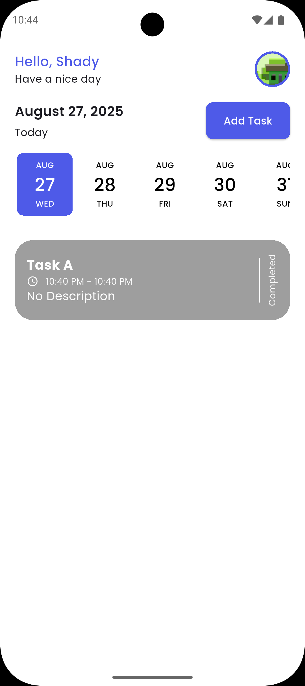
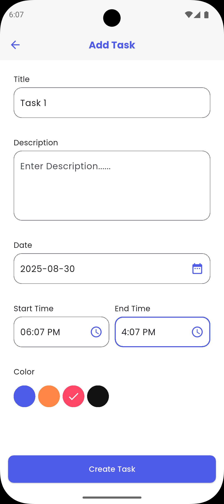
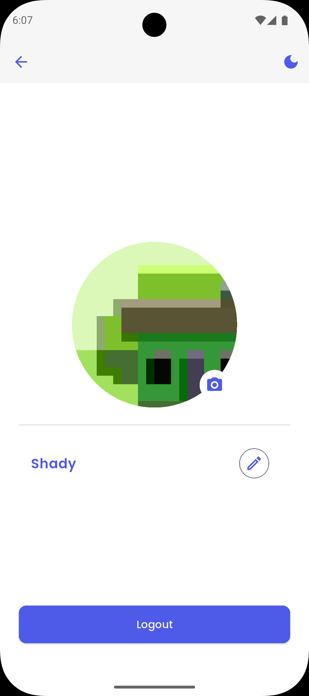

# 📌 Taskati – Task Management App

Taskati is a modern **Flutter-based Task Management App** designed to help users stay productive with a **simple, elegant, and efficient experience**.  
This project was developed as part of the **DEPI Cross-Platform Training**.

---

## ✨ Features

- 📝 **Task Management**
  - Add, edit, delete, and mark tasks as completed.
  - Color tagging for better task organization.

- 📅 **Smart Scheduling**
  - Date picker for selecting deadlines.
  - Start & end time selection.
  - Daily timeline view.

- 👤 **Profile & Settings**
  - Edit username.
  - Change profile picture (camera/gallery).
  - Logout functionality.

- 🌙 **Theme Support**
  - Light & dark mode toggle with persistence.

- 💾 **Local Storage**
  - Offline data caching powered by **Hive**.

- 🎬 **Smooth UX**
  - Animated splash & signup flow.
  - Lottie-based empty state.
  - Responsive & adaptive UI for both mobile and desktop.

---

## 📽️ Demo


---

## 📸 Screenshots

| Home Screen | Add Task | Profile |
|---------------|-------------|----------|
|  |  |  |

---

## 🔌 Plugins Used

- [Hive](https://pub.dev/packages/hive) & [hive_flutter](https://pub.dev/packages/hive_flutter) – Local NoSQL database
- [Image Picker](https://pub.dev/packages/image_picker) – Pick images from camera/gallery
- [Intl](https://pub.dev/packages/intl) – Internationalization & date formatting
- [Lottie](https://pub.dev/packages/lottie) – Render Lottie animations
- [Gap](https://pub.dev/packages/gap) – Easy spacing widgets
- [File Selector](https://pub.dev/packages/file_selector) – Native file picker for desktop
- [Flutter SVG](https://pub.dev/packages/flutter_svg) – Display SVG images

---

## 🚀 Getting Started

1. Clone the repository:
   ```bash
   git clone https://github.com/shady-ateff/taskati.git
   cd taskati
